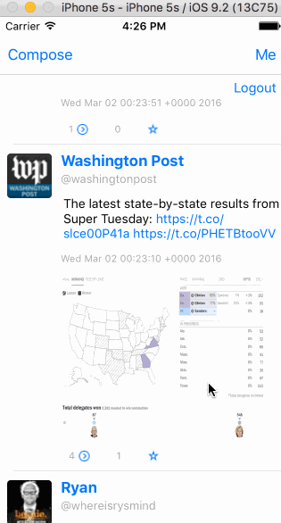

# Project 5 - *Tweeting in EC*

Time spent: **18** hours spent in total

## User Stories

The following **required** functionality is completed:

- [x] Tweet Details Page: User can tap on a tweet to view it, with controls to retweet, favorite, and reply.
- [x] Profile page:
   - [x] Contains the user header view
   - [x] Contains a section with the users basic stats: # tweets, # following, # followers
- [x] Home Timeline: Tapping on a user image should bring up that user's profile page
- [x] Compose Page: User can compose a new tweet by tapping on a compose button.

The following **optional** features are implemented:

- [x] When composing, you should have a countdown in the upper right for the tweet limit.
- [ ] After creating a new tweet, a user should be able to view it in the timeline immediately without refetching the timeline from the network.
- [ ] Profile Page
   - [ ] Implement the paging view for the user description.
   - [ ] As the paging view moves, increase the opacity of the background screen. See the actual Twitter app for this effect
   - [ ] Pulling down the profile page should blur and resize the header image.
- [ ] Account switching
   - [ ] Long press on tab bar to bring up Account view with animation
   - [ ] Tap account to switch to
   - [ ] Include a plus button to Add an Account
   - [ ] Swipe to delete an account

The following **additional** features are implemented:

- [x] Hyperlinks within tweets are clickable
- [x] Images are loaded on tweets if available
- [x] Added endpoint to pull user tweets on profile page
- [x] Added a segmented controller to invoke the like and user tweet endpoints to display those endpoints on the profile view

Please list two areas of the assignment you'd like to **discuss further with your peers** during the next class (examples include better ways to implement something, how to extend your app in certain ways, etc):

1. Implementing the paralaxing header and profile image
2. 

## Video Walkthrough 

Here's a walkthrough of implemented user stories:

## Notes

I think at this point the biggest challenge is actually building out the story board so that auto constraints play nice with each other

## License

    Copyright [2016] [Eric Chu]

    Licensed under the Apache License, Version 2.0 (the "License");
    you may not use this file except in compliance with the License.
    You may obtain a copy of the License at

        http://www.apache.org/licenses/LICENSE-2.0

    Unless required by applicable law or agreed to in writing, software
    distributed under the License is distributed on an "AS IS" BASIS,
    WITHOUT WARRANTIES OR CONDITIONS OF ANY KIND, either express or implied.
    See the License for the specific language governing permissions and
    limitations under the License.

# Project 4 - *Tweeting in EC*

**Tweeting in EC** is a basic twitter app to read and compose tweets the [Twitter API](https://apps.twitter.com/).

Time spent: **20** hours spent in total

## User Stories

The following **required** functionality is completed:

- [x] User can sign in using OAuth login flow
- [x] User can view last 20 tweets from their home timeline
- [x] The current signed in user will be persisted across restarts
- [x] In the home timeline, user can view tweet with the user profile picture, username, tweet text, and timestamp.
- [x] Retweeting and favoriting should increment the retweet and favorite count.

The following **optional** features are implemented:

- [ ] User can load more tweets once they reach the bottom of the feed using infinite loading similar to the actual Twitter client.
- [x] User should be able to unretweet and unfavorite and should decrement the retweet and favorite count.
- [x] User can pull to refresh.

The following **additional** features are implemented:

- [x] Tweets now include images in the cells if available
- [x] Splash Screen

Please list two areas of the assignment you'd like to **discuss further with your peers** during the next class (examples include better ways to implement something, how to extend your app in certain ways, etc):

1. Understanding the tools for using APIs

## Video Walkthrough 

Here's a walkthrough of implemented user stories:

GIF created with [LiceCap](http://www.cockos.com/licecap/).

## Notes

Understanding how to speak to the twitter server has been a challenge. Accessing all parts of a JSON response is still somewhat difficult but i believe I am starting to grasp it.

## License

    Copyright [2016] [Eric Chu]

    Licensed under the Apache License, Version 2.0 (the "License");
    you may not use this file except in compliance with the License.
    You may obtain a copy of the License at

        http://www.apache.org/licenses/LICENSE-2.0

    Unless required by applicable law or agreed to in writing, software
    distributed under the License is distributed on an "AS IS" BASIS,
    WITHOUT WARRANTIES OR CONDITIONS OF ANY KIND, either express or implied.
    See the License for the specific language governing permissions and
    limitations under the License.
